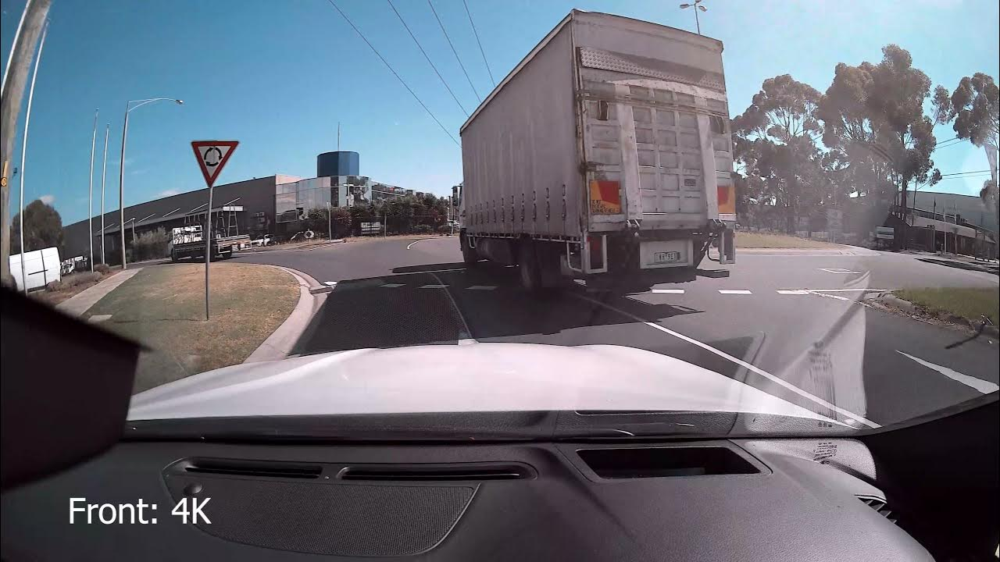

# Segmentation Anything Meta In Traffic (SAM)
In this project, we have used the Segment Anything Meta (SAM) framework developed by Facebook to automatically generate masks for a front view footage of a car from a camera. SAM is a flexible and scalable framework that allows us to generate accurate masks for complex objects with minimal manual labeling effort.

Our results demonstrate that SAM is able to accurately generate masks for the car in the front view footage, even in challenging lighting and weather conditions. By automating the mask generation process, we were able to significantly reduce the time and effort required for manual labeling.

In addition to automatic mask generation, we also used SAM to label a specific object of a car using SAM's point and box labeling utilities. This allowed us to quickly and accurately label the object of interest, without the need for manual tracing.

Overall, our project demonstrates the effectiveness of SAM for automatic mask generation and object labeling, and highlights its potential for use in a wide range of applications.

## Automatic Mask Generator:

<table>
  <tr>
    <td>
      <figure>
        
        <figcaption>Original Image</figcaption>
      </figure>
    </td>
    <td>
      <figure>
        
        <figcaption>Automatic Mask Segmentation</figcaption>
      </figure>
    </td>
  </tr>
</table>

## Labeling Objects:

<table>
  <tr>
    <td>
      <figure>
        
        <figcaption>Object Detection</figcaption>
      </figure>
    </td>
    <td>
      <figure>
        
        <figcaption>Specific Object Detection (Point)</figcaption>
      </figure>
    </td>
    <td>
      <figure>
        
        <figcaption>Specific Object Detection (Box)</figcaption>
      </figure>
    </td>
    <td>
      <figure>
        
        <figcaption>Specific Object Detection (Point+Box)</figcaption>
      </figure>
    </td>
  </tr>
</table>
